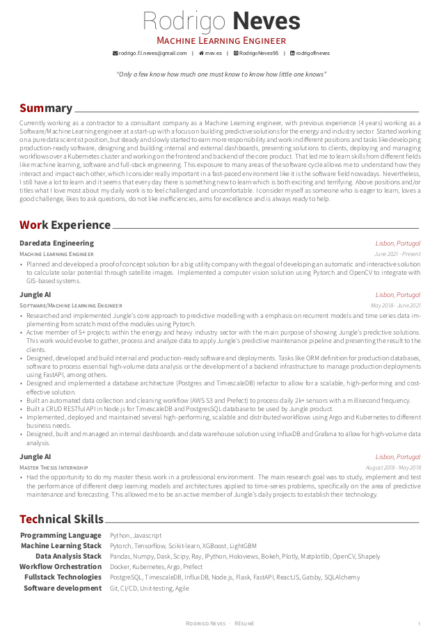

# Content
Repository to my go-to CV and cover letter with a Latex template that compiles over a docker image.

Work inspired from [https://github.com/sb2nov/resume](https://github.com/sb2nov/resume) and [https://github.com/posquit0/Awesome-CV](https://github.com/posquit0/Awesome-CV)

Example



---

## How-to

There are few steps needed to build and create the CV and the cover letter. First you will need to build the docker image

```
make build
```

Once this steps concludes you can create your CV or cover letter with the following commands:

```
make cv
```
and
```
make cover_letter
```

Note: Once the build is done, both commands will try to open the file with [gio](http://manpages.ubuntu.com/manpages/bionic/man1/gio.1.html) CLI. You will find the PDFs inside `resume` folder.

---
## Small guidelines

There are two main files inside `resume/` folder, one for the CV(resume.tex) and the other for the cover letter(coverletter.tex). Both of them are fully customazible. Each file has multiple comments, explaining how you can make modifications to the layout and/or content. 

Regarding the CV there is a specific file for each one of the sections, that you will need to change accorddingly to your will.

