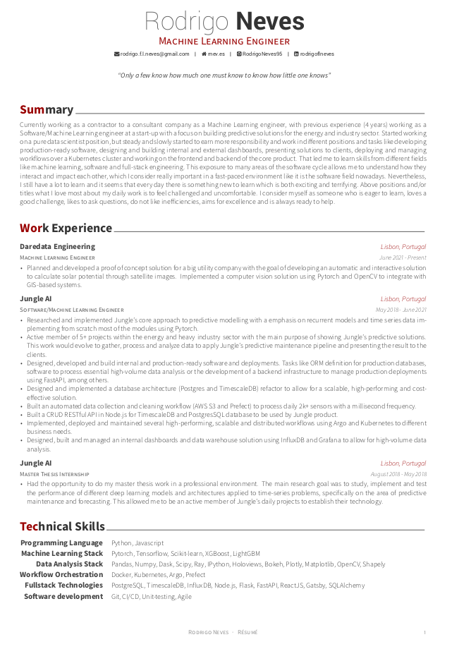

# Résumé sources

Source and generated artifacts for Rodrigo Neves's résumé, plus a customizable LaTeX cover-letter template. The cover letter contains conspicuous placeholders and must be personalized before use.

The layout is inspired by [sb2nov/resume](https://github.com/sb2nov/resume) and [Awesome-CV](https://github.com/posquit0/Awesome-CV).



## Commands

Build the résumé from a clean checkout:

```bash
make resume
```

The generated file is written to `build/resume.pdf`. Build a personalized cover letter with:

```bash
make cover-letter
```

Publish the generated résumé to both tracked distribution locations:

```bash
make publish-resume
```

Verify that the tracked PDFs match each other and the current source:

```bash
make verify
```

Use `make clean` to remove the temporary `build/` directory. The cover-letter PDF is intentionally ignored by Git. Review and replace every angle-bracketed placeholder in `resume/coverletter.tex` before using it.

## Source layout

The `resume/` directory contains `resume.tex` for the résumé and `coverletter.tex` for the cover-letter template. The résumé has a separate source file for each included section under `resume/files/`.
